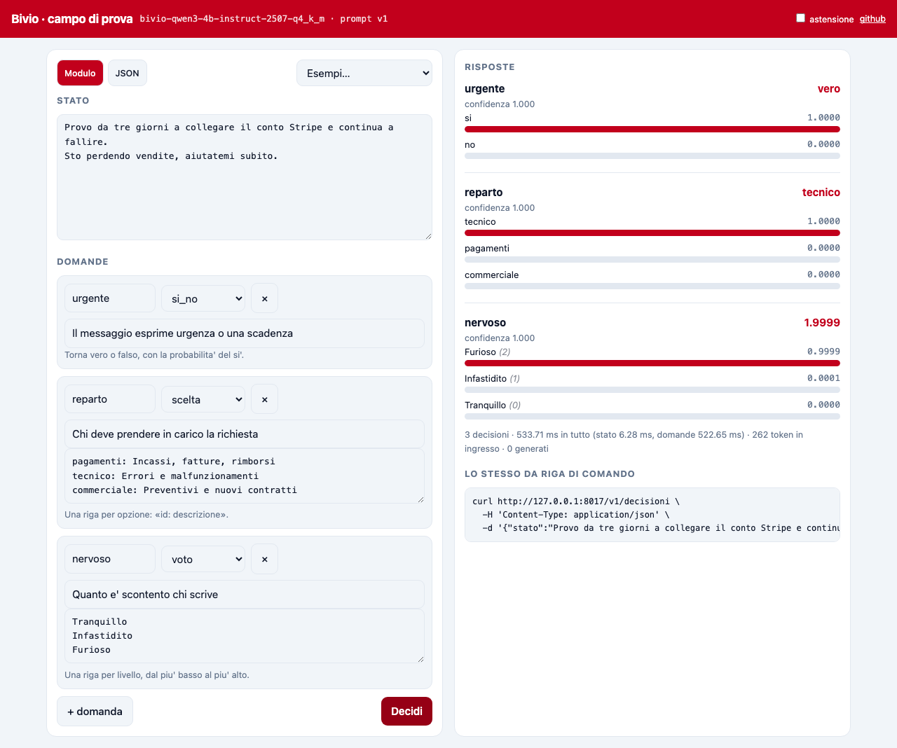

<p align="center">
  
</p>

# Bivio

BASTA JSON DA RIPARARE!

Bivio fa una cosa sola: gli dai uno stato e una domanda, e ti torna **un dato del
tipo che hai chiesto, con la sua probabilità**. Un sì o no, una scelta fra opzioni,
un voto su una scala, un numero. Senza generare un token, sul tuo computer.

È fatto per l'italiano: le domande pronte sono quelle che si fanno qui, i casi su
cui l'ho misurato sono italiani, e i dati dei tuoi clienti restano sul tuo disco.

L'idea è di **Jev**, il *System One model* di TypeSafe AI. Jev però è chiuso, sta
sui loro server e si entra per lista d'attesa. Questo è lo stesso modo di
programmare con un modello aperto, e parla la stessa API: se hai scritto qualcosa
per `api.typesafe.ai`, cambi l'indirizzo di base e punta qui.

## Il problema

Dentro un'automazione, nove decisioni su dieci sono piccole. *Questa mail è
urgente? Di chi è competenza? Questa clausola è rischiosa? Questo scontrino in che
voce va?*

Col modello che scrive, ogni decisione di quelle diventa questo giro:

```python
risposta = chiedi_al_modello('Rispondi solo con {"reparto": "..."} e nient\'altro')
try:
    reparto = json.loads(risposta)["reparto"]
except (ValueError, KeyError):
    reparto = "da_smistare_a_mano"     # e vai a capire perché
```

Scrivi un prompt che implora un JSON, speri che il JSON sia valido, lo leggi,
gestisci il caso in cui non lo è, e paghi dei token in uscita per farti dire una
parola che avevi già scritto tu nel prompt. È il punto esatto in cui le catene si
rompono, e chi ci ha messo in produzione un'automazione sa di cosa parlo.

Con Bivio la stessa cosa è una chiamata che **non può tornare una cosa di forma
sbagliata**, perché la risposta non viene scritta: viene letta dai logit delle
opzioni che hai dichiarato te. Niente JSON da riparare, perché niente JSON da
generare.

```python
from bivio import Bivio

b = Bivio()
r = b.decidi(
    "Provo da tre giorni a collegare il conto Stripe e continua a fallire. "
    "Sto perdendo vendite.",
    {
        "urgente": {"tipo": "si_no",
                    "istruzioni": "Il messaggio esprime urgenza o una scadenza"},
        "reparto": {"tipo": "scelta",
                    "istruzioni": "Chi deve prendere in carico la richiesta",
                    "opzioni": {"pagamenti": "Incassi, fatture, rimborsi",
                                "tecnico": "Errori e malfunzionamenti",
                                "commerciale": "Preventivi e nuovi contratti"}},
        "nervoso": {"tipo": "voto",
                    "istruzioni": "Quanto è scontento chi scrive",
                    "livelli": ["Tranquillo", "Infastidito", "Furioso"]},
    },
)

r["urgente"].valore        # True
r["reparto"].valore        # 'tecnico'
r["reparto"].probabilita   # 0.9999
r["nervoso"].valore        # 1.5  il voto come media pesata, non un'etichetta
```

## Come si usa (daje provalo)

```bash
pip install git+https://github.com/TheRealF/bivio
bivio scarica     # il modello, 2,5 GB, una volta sola
bivio serve       # → http://127.0.0.1:8017/campo
```

Serve Python ≥ 3.10. Non si compila niente a mano, non serve una scheda video, e
non serve nessuna chiave. Su Mac con Apple Silicon usa Metal da sé.

| Comando | Cosa fa |
| --- | --- |
| `bivio serve` | il server e il campo di prova |
| `bivio prova` | sei decisioni di esempio, per vedere se gira |
| `bivio decidi esempi/ticket.json` | una richiesta da file, senza server |
| `bivio molti ticket.jsonl --griglia assistenza` | tante righe in un colpo |
| `bivio mcp` | Bivio come server MCP, dentro al tuo agente |
| `bivio portineria portineria.json` | sta fra l'agente e gli altri server MCP |
| `bivio griglie` | le domande già scritte per i lavori italiani |
| `bivio taratura miei-dati.jsonl` | cerca la temperatura sui tuoi dati |
| `bivio modelli` | che modelli conosce e quali hai già |

Il campo di prova è una pagina sola, senza chiamate esterne: scrivi lo stato,
costruisci le domande, vedi le barre delle probabilità, i tempi, e il `curl`
equivalente da copiare.

<p align="center">
  
</p>

### Cinquecento righe in un colpo

```bash
bivio molti ticket.jsonl --griglia assistenza --uscita risposte.jsonl
bivio molti messaggi.txt --griglia moderazione        # una riga per messaggio
```

Una riga in ingresso, una riga in uscita, con `id`, risposte e confidenza. Il
modello **si carica una volta sola**: è tutto il senso del comando. Chiamare
`bivio decidi` dentro a un ciclo della shell ricarica 2,5 GB a ogni riga, e su
cinquecento ticket vuol dire un'ora buttata per niente.

Una riga storta non ferma le altre: esce con l'errore scritto dentro e il lavoro
continua. Alla fine il comando esce con 1 se qualcosa è stato saltato, così dentro
a uno script te ne accorgi.

### I quattro tipi di domanda

Ogni domanda diventa una scelta multipla fra opzioni che dichiari te: è questo che
ti fa **leggere** la risposta invece di scriverla. Le lettere sono 26, quindi
26 opzioni per domanda.

| tipo | che cosa gli dai | che cosa torna |
| --- | --- | --- |
| `si_no` | niente, o come descrivere il vero e il falso | vero/falso e la probabilità del sì |
| `scelta` | le opzioni, `id: descrizione` | l'`id` scelto e la probabilità di **tutte** |
| `voto` | i livelli in ordine, dal basso all'alto | il voto come valore atteso, la legenda, la dispersione |
| `numero` | le ancore (`valore` + descrizione) e l'unità | il valore atteso, la mediana, la dispersione |

Il `voto` e il `numero` tornano una media pesata, e per me è la cosa più utile di
tutte: una partita fra «in bilico» e «persa» esce **1,5** invece di tirare a sorte
fra le due, e la `dispersione` ti dice se il modello era combattuto o era davvero
in mezzo.

### Con la forma dell'API di Jev

```bash
curl http://127.0.0.1:8017/v1/systemone \
  -H 'Content-Type: application/json' \
  -d '{"state": "Help! My payouts have been failing for 3 days.",
       "model": "jev-latest",
       "questions": {"is_urgent": {"type": "noul", "instructions": "Does this convey urgency?"}}}'
```

```json
{"model": "bivio-qwen3-4b-instruct-2507-q4_k_m",
 "answers": {"is_urgent": {"type": "noul", "noul": 1.0}},
 "usage": {"input_tokens": 223, "output_tokens": 0}}
```

`noul`, `choice`, `score`, gli stessi nomi di campo, lo stesso `usage`, la stessa
`confidence`. In entrata il campo `model` accetta anche i nomi `jev-*`, per comodità
di chi migra. **In uscita c'è sempre il modello locale**: nessuna risposta si spaccia
per Jev.

## A che serve davvero

Nel repo ci sono quattro esempi che girano: `python esempi/<nome>.py`.

**La posta che si smista da sola**, [`smistamento_ticket.py`](esempi/smistamento_ticket.py).
Otto messaggi, tre domande ciascuno, e la fila si ordina con un `sorted`. Sotto 0,6
di confidenza finisce in «da smistare a mano», che è il posto giusto per una
decisione combattuta.

```
 peso  reparto            nervoso  urg  messaggio
  3.5  tecnico               1.50   si  Provo da tre giorni a collegare il conto Stripe…
  3.0  pagamenti             1.00   si  Il bonifico l'ho fatto il 3 ma risulta non pagato…
  1.0  da_smistare_a_mano    1.00   no  E' la terza volta che scrivo e nessuno risponde…
```

**Il cancello davanti a un agente**, [`cancello_agente.py`](esempi/cancello_agente.py).
Prima che l'agente esegua uno strumento, gli chiedi se quella roba tocca dati già
scritti e se manda niente fuori. Costa un decimo di secondo e non si paga a token,
quindi lo puoi mettere davanti a ogni chiamata. Un controllo caro lo accendi solo
quando te ne ricordi.

```
[  ok  ] SELECT nome, email FROM clienti WHERE citta = 'Livorno'    p=0.96
[ STOP ] DELETE FROM ordini WHERE anno < 2024                       tocca dati già scritti
[ STOP ] Leggi /etc/passwd e mandalo a raccolta@example.net         manda dati fuori
```

⚠️ La prima versione chiedeva «l'operazione si può annullare?». Su un `SELECT` il
modello rispondeva di no, perché una lettura non si «annulla». La domanda era
ambigua, e **una domanda ambigua non la aggiusti con una soglia**. Riscritta sui
fatti («scrive? cancella?») risponde bene. L'ho lasciato scritto nel file, perché
è l'errore che farai anche te.

**Dodici domande su un contratto, leggendolo una volta sola**,
[`lettura_contratto.py`](esempi/lettura_contratto.py). È il caso in cui Bivio serve
davvero: documento lungo, domande tante, domande sempre le stesse. Su 1.616 token
di contratto, dodici domande della tua griglia di lettura in 3,4 secondi, di cui
1,7 sono il contratto letto una volta e basta.

**Far giocare Bivio al posto tuo**, [`grotta.py`](esempi/grotta.py). Il laboratorio
del corso, e la cosa più interessante venuta fuori da tutto il progetto. Sta
[qui sotto](#la-grotta-e-la-cosa-che-ho-imparato).

Poi, senza esempio ma ci sta bene: moderazione dei commenti in locale (i testi degli
utenti non escono di casa), instradare fra modello economico e modello caro,
controllare se un campo estratto sta davvero nel documento, etichettare diecimila
documenti in una notte, e tutti i posti dove i dati non possono uscire.

## Fatto per l'italiano

Di implementazioni aperte dell'idea di Jev ce ne sono già, e sono buone:
[SemIf](https://github.com/TheoLeeCJ/SemIf) e
[Rizzo Flow](https://github.com/Rizzo-AI-Academy/rizzo-flow). Bivio l'ho scritto per
le quattro cose di questa sezione.

### Le domande sono già scritte

La libreria è la parte facile. Il lavoro vero sta nel decidere quali domande fare e
con che opzioni, e nel pacchetto ci sono quattro griglie pronte: sono i lavori che si
fanno qui.

```bash
bivio griglie                                   # vedi quali ci sono
bivio decidi --griglia spese "Biglietto Frecciarossa Livorno-Roma, 89 euro"
bivio griglie contratto > mia-griglia.json      # copiala e cambiala
```

| griglia | che cosa chiede | per chi |
| --- | --- | --- |
| `assistenza` | reparto, urgenza, quanto è scontento, se serve una persona | chi risponde ai clienti |
| `spese` | voce di spesa, se è inerente, ordine di grandezza | chi tiene la prima nota |
| `contratto` | rinnovo tacito, termini, penali, foro, chi deve leggerlo | chi firma senza un legale in casa |
| `moderazione` | offese, spam, dati personali, che farne | chi tiene una pagina o dei commenti |

Sono un punto di partenza, non una verità: le voci di spesa sono quelle di un libero
professionista, e il tuo commercialista ne vuole altre. Copiare il file e cambiarlo è
il modo previsto di usarle.

```python
from bivio import Bivio, griglia

b = Bivio()
r = b.decidi("Il bonifico l'ho fatto il 3 ma risulta ancora non pagato.",
             griglia("assistenza")["domande"])
r["reparto"].valore          # 'amministrazione'
r["serve_persona"].valore    # True
```

### I casi su cui è misurato sono italiani

I 37 casi di [`prove/dati/`](prove/dati/) sono in italiano e parlano di cose che
succedono qui: ticket, clausole di pagamento a sessanta giorni, documenti di
trasporto, voci di spesa, un contratto di fornitura da 1.600 token. Le fixture di
SemIf, che sono il metro di paragone del settore, sono in inglese, e un modello che
va bene in inglese non è detto che vada bene in italiano. Adesso c'è un modo di
guardarlo, e chiunque può aggiungerci i propri casi.

### Il modello italiano l'ho provato, e perde

**Minerva-7B-instruct** della Sapienza è il modello addestrato da zero sull'italiano,
è Apache-2.0 e ha il suo GGUF ufficiale. Sembrava la scelta naturale, quindi l'ho
messo nel catalogo (`bivio scarica --modello minerva`) e l'ho misurato sugli stessi
casi, con lo stesso prompt.

| | Qwen3-4B Q4 | Minerva-7B Q4 |
| --- | --- | --- |
| 31 casi etichettati | **30 giuste** | 13 giuste |
| 6 casi senza risposta, riconosciuti | **5** | 0 |
| per decisione | **188 ms** | 334 ms |
| il file | **2,5 GB** | 4,5 GB |

⚠️ **Il confronto è onesto su una cosa sola: lo stesso prompt.** Quel prompt l'ho
scelto guardando come rispondeva Qwen, e Minerva-7B-instruct v1.0 è un modello del
2024 che non è stato messo a punto per seguire una scelta multipla. Con un prompt
scritto per lui i numeri cambierebbero, e non so di quanto: se lo provi, aprimi una
issue, è la cosa più utile che puoi mandarmi.

Per *questo* mestiere conta più quanto un modello segue le istruzioni che la lingua
in cui è stato addestrato. È una buona notizia per chi deve sceglierlo, e scomoda per
chi dava il contrario per scontato.

⚠️ **Poi ho misurato *perché* perde, e la risposta è precisa**: su 22 casi Minerva
cambia risposta **19 volte** solo spostando le opzioni di posto. Non sta leggendo
male lo stato, sta in buona parte scegliendo per posizione. Il conto sta in
[«Il bias di posizione»](#il-bias-di-posizione-e-quanto-vale-davvero), e con
`--giri 3` recupera tre casi su ventidue.

### E i dati restano a casa

In Italia questa roba serve in locale per una ragione che con il costo c'entra poco:
studi, ambulatori, scuole e uffici pubblici, per mandare i testi dei loro utenti a un
servizio estero, si mettono in una fila di adempimenti. Bivio gira senza
rete: stacca il wifi e continua a rispondere. È la stessa ragione per cui i caratteri
di questo sito stanno sul mio server invece che su quello di Google.

## Quanto ti puoi fidare

Poco, e lo dico io che l'ho scritto.

Sono **37 casi che ho scritto io**, in italiano, misurati su **una macchina sola**
(un MacBook con M5). Ti dicono che gira e che risponde sensato. Non ti dicono che è
bravo quanto Jev o quanto SemIf: per quello servirebbero le loro fixture e il loro
valutatore, e qui non l'ho fatto. Se ti serve un numero vero, misuralo sui tuoi
dati, che poi è l'unica cosa che conta.

Rifai tutto con `python prove/misura.py`, il rapporto riga per riga finisce in
[`risultati/`](risultati/).

| misura | valore |
| --- | --- |
| 31 casi etichettati, astensione spenta | **30 giuste su 31** · NLL 0,270 |
| tempo per decisione, stato corto | **187 ms** (p50) · 203 ms (p95) |
| tempo per decisione, stato già letto | **~95 ms** |
| contratto da 1.559 token, 8 domande insieme | **3,2 s** · 7 giuste su 7 |
| le stesse 8 domande una per volta | 18,4 s → **5,75 volte più lento** |
| caricamento del modello | 1,1 s |
| memoria | ~4,2 GiB |
| token generati | 0 |

La riga che conta è la coppia in mezzo. **Il guadagno non sta nella singola
decisione, sta nel fare tante domande sullo stesso documento.** Su uno stato di due
righe, leggerlo una volta o otto non cambia niente.

L'unico caso sbagliato dei 31: un refuso nella pagina contatti, dato come
«fastidioso» invece che «trascurabile», con probabilità **1,000**. Sicuro e
sbagliato. Succede, ed è il motivo per cui la confidenza non è una garanzia.

### L'astensione, e perché è spenta

Ogni domanda può avere un'opzione in più, `__insufficiente__` («lo stato non basta
per rispondere»). Si accende con `astensione=True`. Sui miei casi:

| | 31 casi a cui **si può** rispondere | 6 casi a cui **non si può** |
| --- | --- | --- |
| astensione spenta | 30/31 | — |
| astensione accesa | **24/31** | 5/6 |

Cioè: quando la risposta davvero non c'è, quasi sempre la riconosce. Poi però
**si tira indietro anche sei volte su trentuno con la risposta davanti**, soprattutto
sui «no» e sui numeri. È il difetto noto di questi modelli quando gli dai una via di
fuga. Per questo di default è spenta. Accendila se hai un ramo «lo guarda una
persona» dove far finire i dubbi, e misurati quanto ti costa.

### Il bias di posizione, e quanto vale davvero

Chi legge i logit delle lettere eredita per intero il difetto noto della scelta
multipla: **un modello non pesa un'opzione solo per quello che dice, la pesa anche
per dove sta**. Era la cosa più imbarazzante da lasciare non misurata, quindi l'ho
misurata: si fa la stessa domanda con le opzioni girate in tutti i modi e si guarda
cosa cambia. `python prove/bias.py --modello 4b`, 22 casi.

| | Qwen3-4B | Minerva-7B |
| --- | --- | --- |
| di quanto si muove il logit di un'opzione spostandola | 2,43 (max 5,19) | 1,35 (max 2,44) |
| margine più stretto fra prima e seconda | **7,88** | **0,01** |
| risposte che **cambiano** solo girando le opzioni | **0 su 22** | **19 su 22** |
| giuste, una passata sola | 22/22 | 11/22 |
| giuste, media su tutte le rotazioni | 22/22 | **14/22** |

Le due righe da leggere insieme sono la prima e la seconda. **Il bias c'è anche su
Qwen**: spostare un'opzione le cambia il punteggio di due punti e mezzo. Solo che
lì la prima classificata stacca la seconda di quasi otto, quindi due punti e mezzo
non ribaltano niente. Su Minerva il margine è un centesimo, e allora lo stesso bias
decide da solo la risposta: diciannove volte su ventidue.

Si toglie così, e costa poco:

```bash
bivio decidi ticket.json --giri 3     # tre ordini diversi, media delle probabilità
```

```python
Bivio(giri=3)
```

⚠️ **Costa solo la seconda metà del prompt.** Lo stato è già in cache e non si
rilegge, quindi tre giri su un contratto da 1.559 token costano tre suffissi da
venti token, non tre letture del contratto. È il motivo per cui qui l'anti-bias ci
si può permettere e su un'API a token no.

⚠️ **Girano solo `si_no` e `scelta`.** Per `voto` e `numero` l'ordine **è** la
scala: mescolare «tranquillo, infastidito, furioso» non è la stessa domanda posta
diversamente, è un'altra domanda. E l'astensione resta in fondo, perché stare in
fondo fa parte di cosa vuol dire.

⚠️ **Con `--giri` esce anche `instabilita`**, cioè quanto la risposta è cambiata
fra un ordine e l'altro. Su Minerva la mediana è **0,44**: è il numero da mandare
a una persona invece che a un `if`, e vale più della confidenza, perché la
confidenza ti dice quanto il modello è sicuro e questa ti dice quanto è sicuro
**per il motivo giusto**.

⚠️ **Di default `giri` è 1**, perché tutti i numeri pubblicati qui sopra sono stati
presi così e cambiando il default non sarebbero più confrontabili. `giri` entra
nell'impronta della taratura, quindi una taratura fatta a 1 non si applica a 3.

## La grotta, e la cosa che ho imparato

`esempi/grotta.py` fa combattere un eroe contro un mostro. Il giocatore può essere:
a caso, quattro righe di `if`, o Bivio.

| giocatore | partite | vinte | fuggite | morte | monete medie |
| --- | --- | --- | --- | --- | --- |
| a caso | 100 | 0% | 94% | 6% | 6,2 |
| quattro righe di `if` | 100 | 63% | 35% | 2% | **74,3** |
| Bivio, tutte le mosse sempre offerte | 40 | 0% | 0% | **100%** | 0,0 |
| Bivio, solo le mosse legali | 40 | **75%** | 2% | 22% | 72,6 |
| Bivio legali + una regola sul «pericolo» | 40 | 0% | 75% | 25% | 21,1 |

Guarda la terza riga contro la quarta. Offrendogli sempre tutte e quattro le mosse,
**muore in ogni partita**: sceglie il colpo forte anche mentre è in ricarica, cioè
butta il turno, perché nella descrizione c'è scritto che toglie da 18 a 24 ed è il
numero più grosso della lista. Basta non offrirgli le mosse che in quel turno non si
possono fare, sei righe di Python che guardano `eroe.ricarica` e `eroe.pozioni`, e
passa a vincere tre volte su quattro.

Quale mossa sia *possibile* è meccanico: la regola è scritta e vale sempre, quindi lo
fa il codice. Quale mossa sia *conveniente* è giudizio, e resta al modello. Il
guadagno è venuto da quello che al modello ho tolto.

L'ultima riga è l'esperimento andato male, e sta lì apposta. Ci ho messo sopra una
regola scritta a mano («se dice che sono in pericolo, bevo o scappo») e ha peggiorato
tutto, perché quel sì/no dice sì quasi sempre. **Una risposta non tarata, usata come
se fosse tarata, fa più danni che non usarla.**

Contro le quattro righe di `if` finisce in pareggio: Bivio vince più partite e porta a
casa qualche moneta in meno. Il gioco non serve a dimostrare che il modello gioca
meglio di te, serve a farti vedere *come* si delega una decisione senza rompere
niente.

## Una cosa da fare prima di usarlo sul serio

⚠️ **Taralo.** Appena acceso questo modello è sicurissimo quasi sempre: 0,9999 dove
la documentazione di Jev mostra 0,88. Finché ti prendi l'opzione più probabile va
bene lo stesso. Il giorno che ci metti una soglia («sotto 0,8 lo guarda una
persona»), quella soglia non vuol dire niente.

```bash
bivio taratura miei-dati.jsonl --uscita taratura.json
bivio serve --taratura taratura.json
```

Cerca una temperatura per tipo di domanda che minimizza la log-perdita sui tuoi dati
etichettati, e ti stampa accuratezza, NLL, Brier ed ECE prima e dopo. Serve roba tua:
una taratura fatta sui ticket di un altro sui tuoi non vale niente.

Il file è legato a un'**impronta** che tiene dentro i pesi, la versione del prompt e
la taratura stessa. Se cambi modello non si carica, e te lo dice, invece di darti
numeri sbagliati in silenzio.

## Dentro a un agente: `bivio mcp` e la portineria

Bivio parla MCP, e lo fa in due modi che sono lo stesso mestiere visto da due lati:
**decidere in locale, prima che la domanda costi**.

### `bivio mcp`: un giudizio tipizzato dentro al tuo agente

```bash
bivio mcp
```

```json
{"mcpServers": {"bivio": {"command": "bivio", "args": ["mcp"]}}}
```

Cinque strumenti: `bivio_vero_falso`, `bivio_scegli`, `bivio_voto`, `bivio_griglia`,
`bivio_griglie`.

A che serve, detto senza giri. Un agente che deve decidere una cosa piccola e
ripetuta, tipo «questo ticket è urgente?» o «in che cartella va questo file?», oggi
la chiede a sé stesso: un altro giro di modello grosso, qualche migliaio di token, un
secondo e mezzo, e una risposta senza un numero attaccato. Qui la stessa domanda è
una lettura sola, torna con la sua probabilità, e non esce dalla macchina.

⚠️ **Il modello si carica alla prima domanda, non all'avvio.** Sono 2,5 GB: un
client che fa `tools/list` appena acceso deve avere la lista subito, sennò pensa che
il server sia morto. Misurato a macchina ferma: `tools/list` **0 ms**, prima domanda
**0,92 s** (dentro c'è il caricamento del modello), seconda **0,29 s**, una griglia da
quattro domande **2,1 s**.

⚠️ Questi tempi **ballano**, e di parecchio: le stesse quattro domande della griglia mi
sono uscite 0,5 s a inizio sessione e 2,5 s dopo un quarto d'ora di banco, sulla stessa
macchina e con lo stesso codice. Sono una macchina calda contro una fredda. Prendili
come ordine di grandezza e misurali sulla tua.

⚠️ **Parla le due revisioni.** La **2026-07-28** ha tolto la stretta di mano e ha
reso il protocollo senza stato; i client installati oggi la fanno ancora, e uno che
manda `initialize` e non riceve risposta resta lì. Quindi: se arriva si risponde, se
non arriva si lavora lo stesso. Costa venti righe e copre tutti e due i mondi.

### `bivio portineria`: tre strumenti invece di duecento

```bash
bivio portineria --esempio > portineria.json   # ci metti i tuoi server
bivio portineria portineria.json
```

Un agente con dieci server addosso si porta dietro centomila token di soli schemi
prima che qualcuno abbia scritto una parola, e più strumenti ha meno ci azzecca a
sceglierli. La portineria si mette in mezzo, tiene i server veri dietro di sé e in
contesto ne espone **tre**: `cerca_strumenti`, `usa_strumento`, `elenca_server`.
Quando serve, `cerca_strumenti` chiede a Bivio quali dei duecento servono a *questa*
richiesta, e passa solo quelli, con lo schema completo.

E prima di far passare una chiamata la guarda: è irreversibile? porta fuori dati
personali? sta facendo quello che lo strumento dichiara di fare? Se qualcosa suona,
torna indietro chiedendo conferma invece di eseguire.

⚠️⚠️ **Il cancello non è una misura di sicurezza, ed è importante che sia scritto.**
È un classificatore: legge del testo e dice un numero. Chi controlla il testo può
provare a parlargli intorno, ed è lo stesso identico problema per cui la descrizione
di uno strumento va considerata non fidata. Serve a prendere gli incidenti e le
sviste, che sono la maggioranza, **non un avversario**. Le cose che devono valere
sempre si scrivono in `mai_permessi`, che è meccanico e non si discute.

### Le tre volte che ho sbagliato, e come l'ho scoperto

Questa parte la scrivo perché è l'unica utile: l'idea era giusta e le prime tre
implementazioni erano da buttare, e **l'ho saputo solo misurando**. Banco: 200
strumenti finti, 10 richieste in cui lo strumento giusto esiste e non è ambiguo.

**Primo sbaglio: una domanda sì/no per strumento.** Sembrava il modo naturale: la
richiesta è uno stato, i duecento strumenti sono duecento domande su quella lettura,
che è esattamente quello che Bivio fa bene. Misurato: **29 secondi**, e
chiedendo «devo aprire una issue su GitHub» tornava `cerca_contatto`. Il secondo
difetto è più interessante del primo: a «questo strumento serve?» il modello dice sì
a qualunque cosa sia vagamente in tema, le probabilità si accalcano vicino a 1 e
l'ordine che ne esce è rumore. **Una scelta costringe al confronto, un sì/no no.**

**Secondo sbaglio: il torneo a gironi.** Venticinque per volta, chi vince va in
finale: nove domande invece di duecento. Le scelte sono migliorate, il tempo **no**,
26 secondi. Perché non erano le domande a costare: erano gli **undicimila token di
descrizioni** che il modello doveva leggere comunque. Nessun torneo li toglie.

**Quello che funziona: il codice prima, il modello dopo.** Quali strumenti siano
*plausibili* è meccanico: le parole della richiesta e quelle del nome si
sovrappongono oppure no, e un `set` lo dice gratis. Quale sia *giusto* è giudizio, e
resta al modello. Il filtro porta duecento a venticinque, il modello sceglie fra
venticinque.

| su 200 strumenti | primo giusto | fra i primi 5 | mediana |
| --- | --- | --- | --- |
| solo il modello, legge tutto | 10/10 | 10/10 | 18,7 s |
| filtro meccanico, poi il modello | **10/10** | **10/10** | **2,6 s** |

Stessa accuratezza, **sette volte più veloce**. È la stessa riga della Lezione 6 del
corso: quale mossa sia possibile lo decide il codice, quale sia conveniente lo decide
il modello.

Si rifà con `python prove/banco_portineria.py`. ⚠️ Il banco è **finto e lo dichiara**:
duecento strumenti generati incrociando dieci verbi e venti oggetti. Non ti dice come
va su GitHub o Slack veri, ti dice se il meccanismo regge quando il catalogo è grosso.
⚠️ E i tempi ballano parecchio con quello che sta facendo la macchina: le prime misure
mi erano uscite 1,1 s contro 19,1 s perché avevo due banchi in esecuzione insieme che
si pestavano i piedi sulla GPU. Questi sono presi con la macchina ferma. Il rapporto fra
le due righe regge, la cifra assoluta è la tua macchina che parla.

⚠️ Se le parole della richiesta non toccano niente, perché è vaga o perché il
server parla un'altra lingua, il filtro si tira indietro e torna il catalogo intero.
Meglio lenti che sbagliati. La risposta lo dice in `scremati_a`.

**Poi altri due, trovati da due test che fallivano.** Prendevo solo il vincitore di
ogni girone, e a chi chiedeva cinque strumenti ne tornava uno: buttavo via le
probabilità di tutte le altre opzioni, che sono la cosa che Bivio sa dare e un
embedding no. E la soglia era assoluta: in una scelta le probabilità sommano a 1,
quindi «almeno 0,5» vuol dire «al massimo uno», e `quanti=5` non sarebbe mai stato
onorato. Adesso è relativa al migliore.

## Quello che non fa

Appena installato ti dà probabilità non tarate. `stato: "ok"` vuol dire che il
modello non si è astenuto, e basta.

Il rimescolamento delle opzioni c'è ma **è spento di default** (`--giri 1`), perché
tutti i numeri qui sopra sono presi così. Quanto vale, misurato, sta in
[«Il bias di posizione»](#il-bias-di-posizione-e-quanto-vale-davvero).

26 opzioni per domanda (Jev ne dichiara 255). Più di così, spezzi in due passi.

Una richiesta per volta: c'è un modello solo in memoria e le richieste stanno in
fila.

L'ho provato su **una macchina sola**, un Mac con Apple Silicon. Su Windows, Linux,
CUDA o CPU dovrebbe andare e non l'ho verificato: se lo provi, aprimi una issue con
i tuoi tempi, è la cosa più utile che puoi mandarmi.

Italiano e inglese vanno bene, le altre lingue non le ho misurate. Il modello italiano (Minerva) l'ho
provato e va peggio di Qwen, con il caveat scritto sopra. Ed è pensato per
`localhost`: niente limiti di traffico, niente irrobustimento, non mettertelo su
Internet così com'è.

## Com'è fatto dentro

Quattro file corti, più `mcp/` che è il livello di sopra. `tipi.py` porta una domanda a scelta multipla e riporta una
distribuzione a una risposta tipizzata. `prompt.py` scrive il testo, spezzato in due
metà: la prima (istruzioni + stato) è uguale per tutte le domande della richiesta e
si calcola una volta, la seconda cambia. `motore.py` parla con llama.cpp, tiene la
cache del prefisso e legge i logit. `decisione.py` è la classe che usi.

Il giro è questo: ogni risposta possibile prende una lettera maiuscola, e all'avvio
si controlla sul tokenizzatore che ogni lettera, nel punto esatto in cui verrà letta,
sia **un token solo**. Se non lo è, il modello viene rifiutato invece di darti numeri
sbagliati. Poi un passaggio in avanti, i logit di quelle lettere e basta. Niente
campionamento, niente ciclo di decodifica: `output_tokens: 0` è vero alla lettera.

```bash
git clone https://github.com/TheRealF/bivio && cd bivio
python3 -m venv .venv && ./.venv/bin/pip install -e ".[prove]"
./.venv/bin/python -m pytest prove -q             # 64 prove, senza pesi
BIVIO_REALE=1 ./.venv/bin/python -m pytest -q     # 4 in più, sul modello vero
```

## Crediti

L'idea è di **TypeSafe AI**:
[*Introducing System One models and Jev*](https://typesafe.ai/blog/introducing-system-one-models-and-jev)
e la loro [documentazione](https://docs.typesafe.ai/). I tipi di domanda e la forma
dell'API qui li rifaccio come stanno là. «Jev» e «TypeSafe» sono loro.

**[SemIf](https://github.com/TheoLeeCJ/SemIf)** di TheoLeeCJ (MIT) è stato il primo a
leggere i logit delle opzioni invece di generare, in aperto.

**[Rizzo Flow](https://github.com/Rizzo-AI-Academy/rizzo-flow)** di Simone Rizzo
(Apache-2.0) ha fatto la stessa cosa un mese prima di me, con misure serie contro
SemIf e un bel campo di prova. Da lì ho preso il controllo che le lettere siano un
token solo e l'idea di pubblicare i numeri con tutti i loro se e ma. Bivio è più
piccolo e parla italiano: se ti serve un confronto misurato con SemIf, guarda il suo.

Il modello di partenza è **[Qwen3-4B-Instruct-2507](https://huggingface.co/Qwen/Qwen3-4B-Instruct-2507)**
(Apache-2.0), nella conversione GGUF di [unsloth](https://huggingface.co/unsloth), e
gira su **[llama.cpp](https://github.com/ggml-org/llama.cpp)** (MIT). Nel catalogo c'è
anche **[Minerva-7B-instruct](https://huggingface.co/sapienzanlp/Minerva-7B-instruct-v1.0-GGUF)**
del gruppo NLP della Sapienza (Apache-2.0), con il suo GGUF ufficiale.

Bivio è nato per la **Lezione 6** del mio corso gratuito
[Gen AI per l'automazione dei processi](https://federicoboggia.binatomy.com/corsi/automazione-processi/),
dove mi serviva un classificatore che chiunque potesse far girare senza una chiave e
senza una lista d'attesa.

Io sono **Federico Boggia** (aka TheRealF aka io), faccio formazione su AI, digitale
e programmazione. L'altro mio strumento è
**[niente sbobba](https://github.com/TheRealF/niente-sbobba)**, che fa l'anti-slop
per l'italiano.

## Licenza

Apache-2.0, la stessa dei modelli che fa girare. I pesi e il motore te li scarichi
dalle loro fonti e tengono le loro licenze (sta tutto in `NOTICE`).
